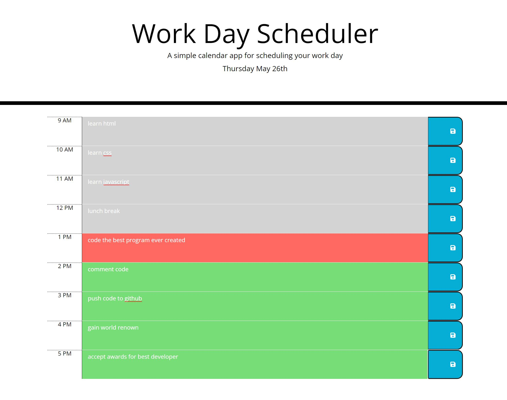

# theGreatestWorkDayScheduler

when the page loads you are presented with a work day scheduler from 9am to 5pm

it will color the time blocks according to the current time using moment

if the time block is in the past it will be grey, the present hour will be red and all future hours will be green

you can write text in the middle boxes

when you press the save button on the right it will be saved to local storage so when you refresh the page the text will stay

live site: https://zzaclipse.github.io/theGreatestWorkDayScheduler/

